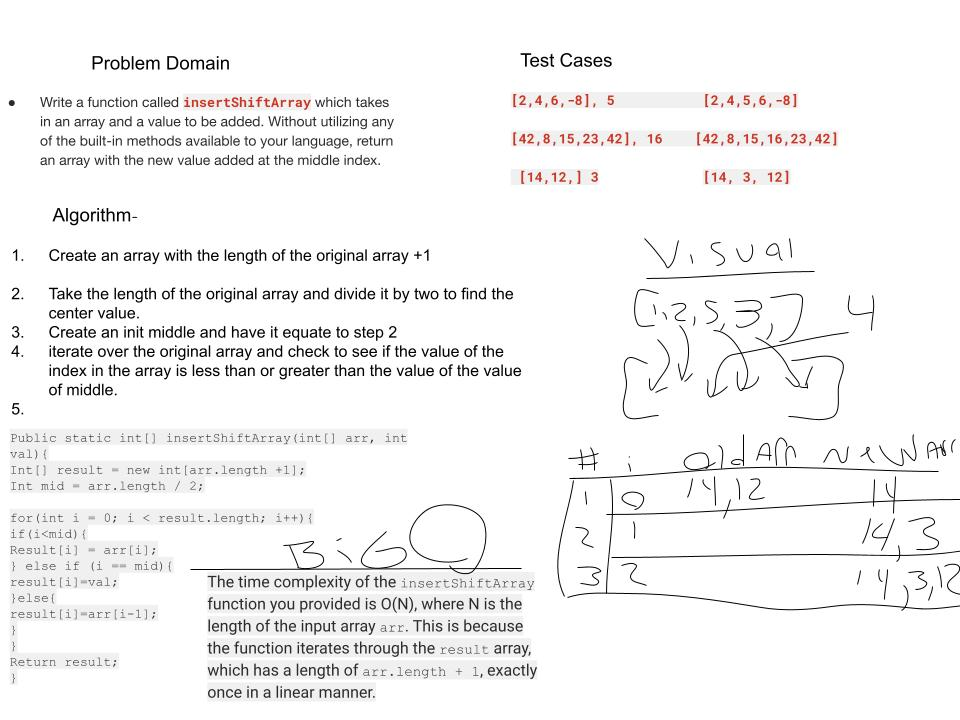

Write a function called insertShiftArray which takes an array and a new value to be added as an argument. without utilizing any of the built-in methods available to your language, return with the new value added to the middle index.

# Whiteboard process

